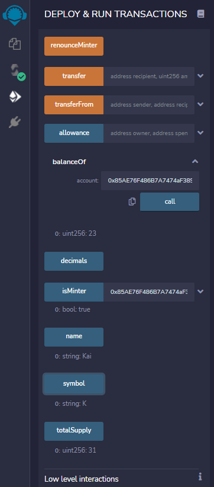

# Advanced Solidity - ERC-20 Token - Crowdsale
## By Franklin Vaca

The program/code can be found in the KaseiCoin.sol and KaseiCoinCrowdsale.sol files located in the Starter Code folder. 
The code was witten on Solidity and the contracts were compiled and deployed using REMIX IDE. The contracts were tested using Ganache testnet and the addresses were connected via Metamask. The pictures presented below are located in the Evaluation_evidence folder. The screenshots display the contracts succesfully compiled, the deployment of the contracts and the transactions that were used to test the contracts. Screenshots from Ganache (transaction history) and Metamask indicate the interaction between the addresses and the contract.

## **Step 1 _ KaseiCoin Token Contract**

*KaseiCoin Token Contract succesfully compiled* 

 

No issues were found during compilation as indicated by the check mark and no error messages.

## **Step 2 _ KaseiCoin Crowdsale Contract**

*KaseiCoin Crowdsale Contract succesfully compiled* 

 

## **Step 3 _ KaseiCoin Deployer Contract**

*KaseiCoin Deployer Contract succesfully compiled* 

 

The crowdsale and deployer contracts were succesfully compiled and no error messages were found

## **Step 4 _ Contracts deployed and tested in a Local Blockchain**
*Contract deployment:* 

 

Token Kai (Symbol K) was created.

*Metamask confirmation request and estimated gas fees for contract deployment:*

 

*Contract was succesfully deployed, contract now appears under the deployed contracts section:*

 

0.03 ETH were taken from Ganache Account 1 Address 0xa98... was reduced from 100 ETH to 99.97 ETH.

 

Ganache's transaction history displays the contract creation and transaction hash:

 

## **Test 1: Minting 8 tokens on 0xa98... address:**

*Using the mint function of the contract:* 

 

*Metamask confirmation and gas fees:* 

 

*New balance on the 0xa98... address:*

 

*Transaction registered on Ganache's transactions history:*

 

## **Test 2 (Minting on a different address): Minting 23 tokens on 0x85A... address:**

*Adding a new minter:* 

 

*Metamask confirmation and gas fees:* 

 

*Validating new minter was accepted:*

 

 Using the "isMinter" button: true, this confirms that the new address 0x85A... was accepted as a minter.

*Using the mint function to mint 23 tokens:* 

 

*Metamask authorization request and estimated gas fees to proceed:*

 

*New balance on the 0x85A... address (23 tokens minted):*

 

*Transaction registered on Ganache's transactions history:*

 

## **Test 3 Total Supply of Kai tokens minted:**

*31 tokens = 23 tokens (first transaction) and 8 tokens (second transaction)*

 

## **Test 4 Transfering tokens minted:**

*Transfering 4 Kai tokens to 0x85A...*

 

*Metamask authorization request and estimated gas fees to proceed:*

 

*New balance on the 0x85A... address (27 tokens):*

 

*Transaction registered on Ganache's transactions history:*

 

*Total supply remains the same since the transaction was a transfer and no new tokens were minted:*

 

*The number of Kai tokens in 0xa98... address decreased from 8 (initially) to 4 after the transfer to 0x85A... :*

 

